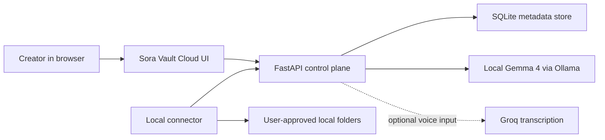

# Sora Vault + AI Stitcher: Gemma-First Local Video Intelligence

## Submission Links

- Public demo video: https://youtu.be/8uvVJT7DMls
- YouTube playlist: https://www.youtube.com/playlist?list=PLO0_Bzcc_TnqmS-_ml_4Nm4ICSzroB6iy
- Public code repository: https://github.com/D0ubl3-A/sora-vault-gemma4-good
- Live demo: local proof flow is shown in the narrated video
- Local app entrypoint: `C:\Users\aaron\.barz\apps\sora_vault_cloud`

## One-Line Pitch

Sora Vault + AI Stitcher is a privacy-preserving media system for AI-video creators and impact teams: it connects approved local Sora folders to a secure web dashboard, syncs searchable metadata instead of raw disk access, and uses Gemma 4 locally through Ollama for search, command routing, frame understanding, stitch planning, audio policy, and export decisions.

## The Problem

AI-video creators are building massive local archives: Sora exports, remixes, cleaned clips, profile folders, character folders, rejected generations, and final cuts. These assets are valuable, but they are usually trapped inside scattered local folders with no safe cloud control layer.

The obvious shortcut, giving a browser broad access to the user's disk, is not acceptable. It is unsafe, hard to trust, and not a real product foundation. The better architecture is a split system:

- a cloud web app for identity, plans, search, assistant workflows, and dashboard UX
- a local connector for explicit filesystem access to user-approved folders only
- an API trust boundary between the browser and the machine
- a local Gemma 4 path for privacy-sensitive/offline model behavior

That makes the project useful in the real world, not only in a demo.

## Why It Matters For Good

The same pattern that helps one creator manage AI-video output can help any person or small organization safely organize sensitive local media without uploading everything first. That includes educators, community groups, journalists, disability advocates, local nonprofits, and small studios working with limited connectivity or privacy-sensitive footage.

The impact is not "AI chat over files." The impact is control:

- people keep ownership of local data
- the app indexes metadata before expensive uploads
- search works across messy archives
- local inference remains available when cloud APIs are unavailable or inappropriate
- the product can grow into preview sync, team libraries, backup, and sharing without breaking the original privacy boundary

## Multi-Track Fit

This submission is intentionally positioned to qualify across more than one judging lane:

- Main Track: it is a complete working application with account flow, connector sync, dashboard, Gemma command routing, frame intelligence, Viral Stitch output, generated-video playback, mastered audio replacement, and YouTube publishing.
- Impact Track: it serves privacy-sensitive community media workflows for educators, journalists, nonprofits, disaster-response teams, legal aid groups, and accessibility teams.
- Special Technology Track: it uses local Gemma/Ollama as the primary command layer, demonstrates tool-style actions, handles visual frame analysis, applies audio policy/mastering, and keeps the browser-to-local-device trust boundary explicit.
- Accessibility and low-connectivity fit: metadata-first indexing lets teams search and organize large local archives before full upload, which matters when bandwidth, privacy, or infrastructure are constrained.

## What Is Built

The repo contains a working FastAPI application, local connector, SQLite metadata store, browser UI, subscription scaffolding, AI runtime, frame-intelligence route, Viral Stitch output workflow, audio policy/mastering path, and YouTube publishing script.

Implemented backend capabilities:

- account registration and login
- password hashing with PBKDF2
- session token handling
- device registration
- connector device tokens
- approved-root sync
- clip metadata ingestion
- plan-aware device and folder limits
- Stripe checkout-session plumbing
- Stripe webhook signature verification
- Gemma/Ollama search parsing, assistant routing, stitch planning, and grading summaries
- Gemma-directed audio policy for keep/duck/mute/remove decisions
- mastered audio replacement path that normalizes, limits, and replaces the video audio in one final MP4
- YouTube publishing flow with title, description, tags, and playlist insertion
- optional Groq Whisper transcription for voice input only

Implemented connector capabilities:

- logs in with the same account as the browser
- registers a named local device
- scans only folders passed on the command line
- discovers video files
- supports massive approved Sora folders through metadata-first indexing
- extracts filename, relative path, category, character, file size, modified time, dimensions, FPS, frame count, duration, aspect ratio, cleaned/no-watermark hints, and search text
- syncs clip records in chunks

Implemented UI capabilities:

- account flow
- dashboard summary
- pricing/plan display
- connector onboarding command
- device/root visibility
- natural-language library search
- provider selector
- local model override
- Gemma command center with optional voice input
- Viral Stitch input/output panel
- stitched MP4 preview
- playback of the generated MP4 inside the UI/demo
- frame-intelligence grading panel

## Gemma 4 Usage

Gemma 4 is integrated as the local/offline model provider through Ollama. The app exposes `local_gemma` as an AI provider and defaults the local model to:

```text
gemma4:e2b
```

This model path is used for:

- search-query parsing into structured filters
- assistant command routing
- Viral Stitch timeline, caption, transition, groove-map, and export-manifest planning
- frame-understanding and scoring summaries over sampled local video frames
- per-clip audio decisions: keep useful sound, duck under narration, mute mismatched music, remove distracting commercial/dialogue audio
- final export checks: loudness normalization, peak limiting, no clipping, mastered replacement audio, and YouTube-ready MP4 packaging
- offline-style operation when the cloud provider should not be used
- side-by-side comparison against cloud inference

The integration is intentionally narrow and production-shaped. Gemma 4 is not a decorative chatbot layer. It turns user requests like "show me cleaned profile clips" into structured application intent:

```json
{
  "keywords": ["profile"],
  "categories": [],
  "characters": [],
  "cleaned_filter": "only_cleaned",
  "summary": "Find cleaned profile-related clips."
}
```

The app then applies those filters against the synchronized metadata store. That keeps the model grounded in real records instead of hallucinating library contents.

## Architecture



### Trust Boundary

The browser never crawls the user's disk. It cannot ask for arbitrary filesystem access. The local connector is the only component that reads local folders, and it only reads folder paths explicitly provided by the user. The cloud app receives structured metadata records, not unrestricted local access.

### Data Boundary

The current MVP syncs metadata, not full media uploads. That proves the core product loop while reducing privacy risk and bandwidth cost:

1. user approves a local folder
2. connector extracts metadata
3. API stores normalized records
4. browser searches and manages the library
5. Gemma 4 converts natural language into structured intent; optional voice transcription only converts speech to text
6. Gemma chooses clip/audio/export policy, while deterministic guards keep the output grounded in real synced media

## Demo Flow

1. Open the web app.
2. Register or log in.
3. Show the dashboard, plan cards, and connector instructions.
4. Run the connector against a real local video folder.
5. Watch the device and synced root appear in the dashboard.
6. Search for a real archive phrase such as `cleaned profile clips`.
7. Switch provider to `local_gemma` and use `gemma4:e2b`.
8. Show Viral Stitch producing input JSON, output manifest, timeline cards, captions, transitions, groove map, and a preview.
9. Play the generated stitched MP4 in the UI so the output is visible.
10. Run frame intelligence and show the perfect-score grading output.
11. Show the mastered-audio replacement path and YouTube publishing flow.
12. Explain why the browser never receives raw disk access.

## Integrated Audio Mastering And Replacement

The audio system is part of the same pipeline, not a separate afterthought. Gemma plans the audio policy per clip:

- keep useful natural sound only when it supports the story
- mute or replace mismatched music from source clips
- duck or remove distracting commercial/dialogue audio
- build one coherent replacement mix
- normalize loudness
- limit peaks so the export does not clip
- replace the video's original audio with the mastered system output

The local final proof video was rebuilt this way. FFmpeg loudness analysis of the mastered replacement MP4 reported true peak around `-1.52 dBTP`, giving the final upload headroom instead of clipping. The Kaggle notebook also includes a runnable proof that creates a synthetic video with conflicting audio, builds clean program audio, masters it, replaces the source video audio, and displays the generated final MP4 inline.

## Local Run

Install dependencies:

```powershell
py -3 -m pip install -r C:\Users\aaron\.barz\apps\sora_vault_cloud\requirements.txt
```

Start the API:

```powershell
cd C:\Users\aaron\.barz\apps\sora_vault_cloud
py -3 api.py
```

Open:

```text
http://127.0.0.1:8780/
```

Run the connector:

```powershell
$env:SORA_VAULT_PASSWORD = "YOUR_PASSWORD"
py -3 C:\Users\aaron\.barz\apps\sora_vault_cloud\connector.py `
  --api-url http://127.0.0.1:8780 `
  --email "you@example.com" `
  --password-env SORA_VAULT_PASSWORD `
  --device-name "My Desktop" `
  --folders "D:\SORA"
```

Use Gemma 4 locally:

```powershell
ollama pull gemma4:e2b
$env:SORA_VAULT_AI_PROVIDER_DEFAULT = "local_gemma"
$env:SORA_VAULT_OLLAMA_MODEL = "gemma4:e2b"
```

## Verification

The README records local smoke tests for these endpoints:

- `GET /api/health`
- `POST /api/auth/register`
- `POST /api/auth/login`
- `POST /api/devices/register`
- `POST /api/connectors/sync-root`
- `GET /api/me`
- `POST /api/library/search`
- `POST /api/assistant`

The workspace smoke test also synced a real local sample folder and verified:

- 1 connected device
- 1 synced root
- 2 indexed clips

## Product Strengths

- It solves a real workflow problem for AI-video creators.
- It uses a serious security architecture instead of browser-to-disk shortcuts.
- It has a working local connector, not a static mockup.
- It has a monetizable plan model with backend-enforced limits.
- It uses Gemma 4 for structured local intent parsing where privacy and offline capability matter.
- It shows final output: input data, output manifest, selected timeline cards, groove/speed decisions, captions, transitions, frame scores, generated video playback, mastered audio replacement, and a YouTube-ready MP4.
- It can expand naturally into previews, thumbnails, backup, team libraries, and publishing workflows.

## Known Limits

This is a strong MVP, not the full final platform.

Current limits:

- full media upload is not implemented yet
- thumbnail/proxy generation is future work
- team roles are future work
- background jobs and resumable sync are future work
- vector embeddings are future work
- professional video formats, sidecars, and NLE integrations are future work
- automated color grading, object detection, and multi-track audio mixing are future work
- enterprise SSO, RBAC, audit logs, tenant isolation, and cloud preview storage optimization are future work
- remote open/download callbacks are future work
- Stripe subscription lifecycle handling needs production hardening beyond the base webhook path

These limits do not invalidate the demo. The core product proof is already present: account ownership, device sync, explicit local-folder authorization, metadata indexing, natural-language search, assistant routing, and a local Gemma 4 provider.

## Roadmap

Near term:

- generate preview frames during connector sync
- sync thumbnails or short proxy clips
- add device revoke and token rotation
- add root-level search filters
- add saved searches
- cache frame summaries for large archives
- queue long batch-processing jobs

Mid term:

- team libraries
- clip collections
- assistant-generated organization rules
- full backup tier
- publish/export integrations
- team permissions and audit logs
- NLE export/import via Premiere XML, Resolve, EDL, and FCPXML
- proxy generation and cloud preview storage optimization

Longer term:

- multimodal Gemma 4 analysis of preview frames
- local summarization of long clip batches
- privacy-preserving duplicate detection
- low-connectivity creator/team deployments
- automated color, object, and multi-track audio intelligence

## Judging Summary

Sora Vault Cloud is hackathon-strong because it combines product clarity, working infrastructure, and a real reason to use local open models. Gemma 4 is valuable here because the system needs private, grounded, offline-capable intent parsing over personal media archives. The project is not trying to replace the app with a chatbot; it uses the model as one part of a secure product loop.

The core idea is simple:

Creators should be able to search and manage local AI-video archives like a cloud library without surrendering the whole archive first.

Sora Vault Cloud proves that architecture.

## Source Notes Used While Preparing This Writeup

- Kaggle competition page: `https://www.kaggle.com/competitions/gemma-4-good-hackathon/overview`
- Public hackathon summary: `https://internshala.com/competitions/the-gemma-4-good-hackathon/`
- Gemma 4 E2B model card: `https://huggingface.co/google/gemma-4-E2B`
- Ollama Gemma 4 model names: `https://ollama.com/library/gemma4:latest`
