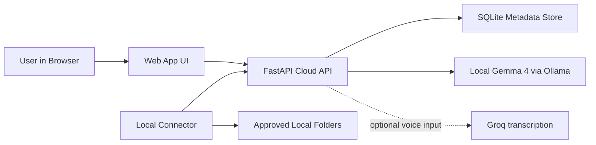

# Sora Vault + AI Stitcher

> Gemma-first software for turning giant local Sora/video archives into a secure searchable library, scored frame understanding, and export-ready stitched videos without giving a browser raw access to a user's machine.

## Hackathon Summary

**What we built**

Sora Vault + AI Stitcher is a hybrid **cloud app + local connector + stitch planner** that lets creators:

1. create an account online
2. pick a subscription tier
3. connect approved local folders from their own machine
4. sync clip metadata into a searchable web dashboard
5. search and operate the archive through Gemma/Ollama commands
6. generate Viral Stitch output with input/output manifests, groove maps, speed ramps, transitions, captions, and a stitched MP4 preview
7. sample frames, save frame understanding, and grade clips toward an export score

**Why it matters**

The web cannot safely crawl arbitrary local disks. Most "cloud drive for local AI outputs" ideas fail right there. This project solves the hard part correctly:

- the **browser** handles identity, billing, search, and UX
- the **connector** handles filesystem access on the user's machine
- the **API** is the trust boundary between the two
- **Local Gemma 4 through Ollama** is the primary command and planning layer
- **Groq transcription** is optional voice input only

This turns a folder of offline clips into a product that can actually be sold as a subscription and expanded into a serious AI video operating system.

---

## The Problem

Creators already have thousands of AI-generated clips living in folders like:

- `D:\SORA`
- `D:\sora no watermarks`
- exported remix trees
- profile folders
- character folders
- cleaned output folders

Those archives are valuable, but they are usually trapped inside local disks, scattered folder structures, and one-off scripts.

The missing product is not "another downloader." The missing product is:

- searchable online access
- account-linked device sync
- plan-gated usage
- secure local-folder connection
- voice and natural-language control
- a path to previews, sharing, and backup monetization

---

## The Big Idea

Treat local AI-media archives like a private media cloud.

The user does **not** upload their whole disk.

Instead:

1. they sign into the cloud app
2. they run a local connector
3. the connector registers a device token
4. the connector scans only approved roots
5. the connector uploads metadata, not arbitrary filesystem access
6. the website becomes the remote dashboard for that library

That architecture is the core innovation of the repo.

---

## Demo Flow

This is the exact story the project is designed to tell in a live demo:

1. Open the web app.
2. Create an account and land on the dashboard.
3. Show the three subscription plans and limits.
4. Copy the connector command from the UI.
5. Run the connector against a real local folder.
6. Watch the device and root appear in the web dashboard.
7. Use Gemma/Ollama search to find cleaned clips, remixes, or profile outputs.
8. Use the command center to jump to billing, devices, connector help, search, frame scoring, or stitch planning.
9. Generate Viral Stitch output: input data, output manifest, groove map, timeline, captions, and MP4 preview.
10. Explain how this scales from metadata sync to previews, sharing, backup, NLE integration, and enterprise permissions.

This gives judges a full stack story:

- product
- security
- AI
- subscriptions
- local device bridge
- creator workflow

---

## Product Positioning

### One-line pitch

**Dropbox for local AI video libraries, but built for creator archives, model outputs, remixes, and metadata-aware search.**

### Why now

- Local creator archives are exploding in size.
- AI video tools change quickly, but local outputs remain durable assets.
- Users want cloud convenience without surrendering local control.
- Gemma/Ollama makes private, local command planning practical for sensitive archives.

### Who it is for

- solo creators with large local generation archives
- studios managing many output folders
- agencies collecting generated assets across machines
- teams that want metadata search before they commit to full cloud storage

---

## What Is Implemented Right Now

This repo is not mock UI. It contains working code for:

- FastAPI backend
- SQLite persistence
- account registration and login
- password hashing
- session tokens
- device registration
- connector sync
- root-level sync tracking
- plan-aware device and folder limits
- Gemma/Ollama query parsing
- Gemma/Ollama assistant command routing
- optional Groq transcription for voice input only
- Viral Stitch planner route
- frame-intelligence and grading route
- Stripe checkout-session plumbing
- Stripe webhook signature verification
- browser dashboard
- connector onboarding command generation

### Smoke-tested in this workspace

I ran the stack locally and verified:

- `GET /api/health`
- `POST /api/auth/register`
- `POST /api/auth/login`
- `POST /api/devices/register`
- `POST /api/connectors/sync-root`
- `GET /api/me`
- `POST /api/library/search`
- `POST /api/assistant`

I also synced a real local sample folder and verified the dashboard reflected:

- 1 connected device
- 1 synced root
- 2 indexed clips

---

## Architecture



### Components

#### `api.py`

The cloud control plane:

- auth
- session handling
- device registration
- sync ingestion
- billing entrypoints
- Gemma-backed search, assistant, stitch, and grading routes
- static app serving

#### `connector.py`

The local agent:

- logs into the same account as the web app
- registers a device token
- scans only caller-approved folders
- extracts clip metadata
- uploads clip records in chunks

#### `storage.py`

The metadata layer:

- users
- sessions
- devices
- roots
- clips
- subscriptions

#### `groq_runtime.py`

The AI routing layer:

- Gemma/Ollama search parsing
- Gemma/Ollama assistant command routing
- Gemma/Ollama stitch and grading command contracts
- optional Groq Whisper transcription for voice input

#### `web/`

The user-facing dashboard:

- account auth
- plan cards
- dashboard metrics
- device and root views
- library search
- voice assistant
- connector onboarding

---

## Security Model

This project is intentionally opinionated about trust boundaries.

### The browser is not allowed to crawl the disk

That means:

- no fake "just grant the website folder access forever" solution
- no silent local file enumeration from browser JS
- no remote shell pattern disguised as sync

### The connector is the only filesystem actor

The connector:

- runs on the user's own machine
- authenticates with the user's cloud account
- gets a device token
- scans only explicit roots provided by the user
- uploads metadata to the API

### Security decisions already present in code

- passwords are PBKDF2-hashed
- session tokens are generated server-side
- device tokens are distinct from session tokens
- Stripe webhooks are signature-verified
- UI rendering escapes dynamic strings before injecting HTML
- connector can use a password environment variable instead of forcing CLI secrets

### Why that matters

This lets the product be both:

- convenient enough to feel cloud-native
- constrained enough to be credible

---

## Subscription Design

The repo includes three plan shapes:

### Starter

- `$19/mo`
- 1 device
- 3 synced roots
- metadata sync
- Gemma search and stitch planner

### Pro

- `$49/mo`
- 5 devices
- 20 synced roots
- multi-folder workflows
- Gemma planner with optional voice input

### Vault

- `$99/mo`
- 10 devices
- 100 synced roots
- backup-grade expansion path
- team sharing roadmap

### Why enforce limits in code

The project is not just visually "subscription ready." It now gates:

- device registration by plan limit
- synced-root creation by plan limit

That is the difference between a demo page and a monetizable backend.

---

## AI Strategy

### Primary provider: Local Gemma 4

Local Gemma 4 runs through Ollama for:

- query parsing
- assistant command routing
- Viral Stitch planning
- frame-grading summaries
- privacy-sensitive/offline operation

### Optional voice input: Groq transcription

Groq is kept as a narrow microphone-to-text path. Voice audio can be transcribed, then the resulting text is handed to Gemma/Ollama for command planning. It is not the core search or assistant brain in this submission.

This makes the product flexible:

- local-first privacy
- explicit provider boundaries
- voice convenience without changing the model story

Default local model:

- `gemma4:e2b`

---

## Data Model

### Tables

- `users`
- `sessions`
- `devices`
- `library_roots`
- `clips`
- `subscriptions`

### Clip metadata shape

Each clip can store:

- `relative_path`
- `title_text`
- `category`
- `character`
- `filename`
- `extension`
- `size_bytes`
- `size_mb`
- `modified_at`
- `width`
- `height`
- `fps`
- `frames`
- `duration_sec`
- `aspect_ratio`
- `looks_cleaned`
- `search_text`
- `source_hash`

This is enough to support:

- searchable libraries
- cleaned vs uncleaned filtering
- category views
- character views
- future preview upload
- future remote actions

---

## Local Connector Design

The connector is the bridge that makes the whole business model viable.

### What it does

1. logs into the cloud API
2. reuses or registers a device token
3. scans local roots
4. inspects video metadata with OpenCV
5. derives category, title, and search text
6. uploads chunked clip payloads

### Why chunked sync matters

It avoids:

- giant request bodies
- brittle single-shot uploads
- poor failure recovery

### Password handling

The connector supports a safer pattern:

```powershell
$env:SORA_VAULT_PASSWORD = "YOUR_PASSWORD"
py -3 C:\Users\aaron\.barz\apps\sora_vault_cloud\connector.py `
  --api-url http://127.0.0.1:8780 `
  --email "you@example.com" `
  --password-env SORA_VAULT_PASSWORD `
  --device-name "My Desktop" `
  --folders "D:\SORA" "D:\sora no watermarks"
```

This is better than forcing plaintext passwords into shell history.

---

## API Overview

### Auth

- `POST /api/auth/register`
- `POST /api/auth/login`
- `GET /api/me`

### Device + sync

- `POST /api/devices/register`
- `POST /api/connectors/sync-root`

### Library

- `POST /api/library/search`

### Assistant

- `POST /api/assistant`
- `POST /api/voice/transcribe`

### Billing

- `POST /api/billing/checkout-session`
- `POST /api/billing/webhook`

---

## Frontend UX

The UI is designed as a real product surface, not a generated admin skeleton.

### Sections

- poster-style hero
- account auth
- plan selection
- dashboard metrics
- device list
- synced roots
- Gemma-powered search
- Gemma command center with optional voice input
- Viral Stitch output panel
- frame-intelligence grading panel
- connector onboarding

### Interaction choices

- clear trust-boundary explanation
- direct onboarding copy
- live provider selection
- local-model override field
- browser TTS for assistant replies
- mic record and stop controls

---

## Why This Is Hackathon-Strong

Judges usually see one of two things:

1. a cool interface with no hard backend story
2. a capable backend with no product energy

This project gives both.

### It scores well on:

- **technical depth**: full stack, local connector, AI routing, auth, billing
- **product clarity**: obvious user, obvious monetization, obvious workflow
- **security maturity**: no fake browser-to-disk shortcut
- **demo quality**: easy to show account, sync, search, assistant, and pricing
- **extensibility**: previews, backup, sharing, and automation can all follow

### It also has a strong "why this architecture" story

The most important engineering decision in the repo is not cosmetic. It is the trust boundary between:

- cloud control
- local data access

That is the real product unlock.

---

## Quickstart

### 1. Install dependencies

```powershell
py -3 -m pip install -r C:\Users\aaron\.barz\apps\sora_vault_cloud\requirements.txt
```

### 2. Configure environment

This app reads secrets from environment variables. Stripe is **owner-only server config** in this project, so end users never enter billing keys in the UI.

If you want a local env file for your own machine, copy the example file:

```powershell
Copy-Item C:\Users\aaron\.barz\apps\sora_vault_cloud\.env.example C:\Users\aaron\.barz\apps\sora_vault_cloud\.env
```

Then fill in:

- `SORA_VAULT_AI_PROVIDER_DEFAULT=local_gemma`
- `SORA_VAULT_OLLAMA_MODEL=gemma4:e2b`
- `GROQ_API_KEY` only if you want optional microphone transcription
- `STRIPE_SECRET_KEY` and plan price IDs when you want billing live on your deployment

### Stripe ownership rule

Stripe stays in server environment variables only:

- `STRIPE_SECRET_KEY`
- `STRIPE_WEBHOOK_SECRET`
- `STRIPE_PRICE_STARTER`
- `STRIPE_PRICE_PRO`
- `STRIPE_PRICE_VAULT`

Customers never configure Stripe from the browser. If those variables are unset, the UI simply shows billing as disabled for that deployment.

### 3. Run the API

```powershell
cd C:\Users\aaron\.barz\apps\sora_vault_cloud
py -3 api.py
```

Open:

- [http://127.0.0.1:8780/](http://127.0.0.1:8780/)

### 4. Register an account

Use the web UI to create the same account the connector will use.

### 5. Sync a local folder

```powershell
$env:SORA_VAULT_PASSWORD = "YOUR_PASSWORD"
py -3 C:\Users\aaron\.barz\apps\sora_vault_cloud\connector.py `
  --api-url http://127.0.0.1:8780 `
  --email "you@example.com" `
  --password-env SORA_VAULT_PASSWORD `
  --device-name "My Desktop" `
  --folders "D:\SORA"
```

### 6. Search the library

Try searches like:

- `cleaned profile clips`
- `remixes with character folders`
- `watermarked originals`
- `show me devices`

---

## Environment Variables

### Core app

- `SORA_VAULT_HOST`
- `SORA_VAULT_PORT`
- `SORA_VAULT_PUBLIC_URL`
- `SORA_VAULT_DATA_DIR`
- `SORA_VAULT_DB_PATH`
- `SORA_VAULT_SESSION_TTL_HOURS`

### Optional Groq voice input

- `GROQ_API_KEY`
- `GROQ_WHISPER_MODEL`

### Local Gemma 4

- `SORA_VAULT_OLLAMA_API`
- `SORA_VAULT_OLLAMA_MODEL` defaults to `gemma4:e2b`
- `SORA_VAULT_AI_PROVIDER_DEFAULT`

### Stripe

- owner-only server environment variables, never client-side user input
- `STRIPE_SECRET_KEY`
- `STRIPE_WEBHOOK_SECRET`
- `STRIPE_PRICE_STARTER`
- `STRIPE_PRICE_PRO`
- `STRIPE_PRICE_VAULT`

---

## Repository Layout

- `api.py` - FastAPI server and product API
- `config.py` - plan definitions and environment settings
- `connector.py` - local scan and sync client
- `groq_runtime.py` - Gemma/Ollama AI runtime plus optional Groq voice transcription
- `security.py` - hashing, token helpers, webhook verification
- `shared_models.py` - Pydantic request models
- `storage.py` - SQLite schema and queries
- `web/index.html` - browser UI shell
- `web/styles.css` - visual system
- `web/app.js` - client behavior
- `requirements.txt` - Python dependencies
- `.env.example` - environment template

---

## Current Known Limits

This is a strong MVP, not the final platform.

### Not done yet

- full cloud media upload
- thumbnail and preview generation
- team invites and role permissions
- background job queue
- resumable large sync jobs
- vector embeddings for semantic recall
- professional NLE export/import such as Premiere XML, DaVinci Resolve, EDL, and FCPXML
- advanced color grading, multi-track audio mixing, object detection, and shot-boundary detection
- enterprise SSO, RBAC, audit logs, tenant isolation, and cloud preview storage optimization
- signed-download and remote-open callbacks
- production Stripe subscription lifecycle hardening beyond base webhook handling

### Why the MVP is still valuable

Even before previews and full uploads, the product already proves:

- account ownership
- local-to-cloud sync
- secure device connection
- AI-assisted archive search
- Viral Stitch output generation
- frame understanding and grading
- monetizable plan structure

---

## Roadmap

### Near term

- add preview frame generation
- upload thumbnails and short proxies
- add root-specific filters in UI
- add device revoke and token rotation
- add cached frame summaries and queued batch processing

### Mid term

- team libraries
- clip collections
- assistant-driven saved searches
- automation rules for archive organization
- team roles, RBAC, and audit logs
- proxy storage and cloud preview optimization

### Longer term

- full backup tier
- remote preview streaming
- publish pipeline integrations
- multi-provider archive ingestion beyond Sora-style exports
- NLE integrations for Premiere, Resolve, and interchange formats
- automated color, object, and multi-track audio intelligence

---

## Judge Talking Points

If this is presented live, the strongest takeaways are:

- "We solved the local-folder problem the right way."
- "This is subscription software, not just a utility script."
- "Gemma is useful because it routes, plans, scores, and grounds output in real synced media."
- "The architecture can expand from metadata sync to full creator cloud."

---

## Final Take

Sora Vault Cloud turns a dead-end archive problem into a credible product:

- online accounts
- subscription logic
- safe local-folder connection
- Gemma-first search, stitch, and grading workflows
- optional voice input
- a clear bridge from local assets to cloud value

That combination is what makes the project feel hackathon-ready and product-ready at the same time.
